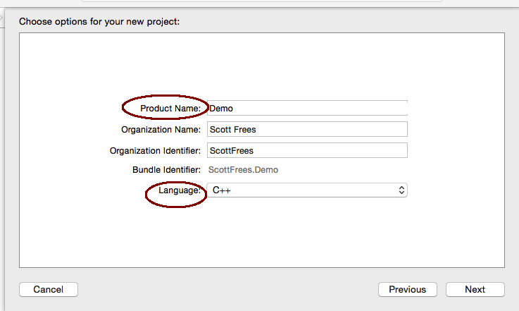

# Creating and Running C++ programs in Xcode
The intended audience for this document is CMPS 147 and CMPS 148 students who are using Xcode instead of Microsoft Visual Studio to build their C++ programs.  Note, the way "pros" use Xcode and the way I'm telling you how to use Xcode is very different.  I've explained how to use Xcode in a way that is most similar to how we use Visual Studio and the command prompt in class/lectures.

## Setting up your Xcode project
Launch Xcode (it should be in your Applications folder).  If you haven't installed it, download it from the Apple App Store (search for Xcode).  It is free.

**On startup**, select "Create a new Xcode project"

**Next**, choose the command line tool template

**Next**, choose C++ project type and name your project.

**Next**, you must choose a location for your project.  Be careful to make sure you remember where you've chosen!

At this point, you should have the full project created.  You'll see something like this:

## Adjusting some preferences
From the top menu, choose Xcode/Preferences.  Choose the "Locations" tab, and click "Advanced"

Select **"Legacy"** from the Build Location options.  This option will make sure your executable always goes in an easy to find location.

## Examine your code
Xcode automatically creates a `main.cpp` file for you, with a standard "Hello World" in it.  Just click the source file to see the code.

## Building and Running
To build, you can type Command+B  (Apply Key + B).  Or, you can **Product** and then **Build** from the top menu bar.  This will create an executable program named after your project name in the `/build/Debug` folder.

To run your project, Open the **Terminal** application.  Change directories to your project's debug folder and type the name of your executable to run.

